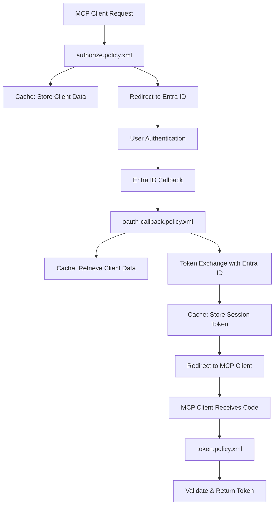

# MCP OAuth认证系统详细说明

## Azure APIM策略架构约束

### 核心限制说明

在Azure API Management (APIM) 中，存在以下重要的架构约束，这些约束直接影响了我们OAuth认证系统的设计：

#### **1. HTTP方法与操作的一对一映射**
- **限制**: 不同的HTTP方法必须定义为不同的操作(Operation)
- **影响**: 每个操作只能绑定一个策略文件
- **原因**: APIM将每个HTTP方法视为独立的API操作

#### **2. 策略文件的独立性**
- **限制**: 每个操作只能绑定一个策略文件
- **影响**: 无法在同一个策略文件中处理多种HTTP方法
- **原因**: APIM的策略引擎要求明确的方法绑定

### 实际应用示例：OAuth元数据端点

以下是这些限制如何影响实际设计的典型例子：

#### **同一URL，不同方法，需要不同文件**

```http
GET /.well-known/oauth-authorization-server     ← 获取元数据
OPTIONS /.well-known/oauth-authorization-server ← CORS预检
```

虽然这两个请求使用**相同的URL路径**，但由于使用**不同的HTTP方法**，在APIM中必须：

1. **定义两个独立的操作**：
   ```bicep
   // GET操作
   resource oauthMetadataGetOperation 'Microsoft.ApiManagement/service/apis/operations@2021-08-01' = {
     properties: {
       method: 'GET'                    // 只能处理GET方法
       urlTemplate: '/.well-known/oauth-authorization-server'
     }
   }

   // OPTIONS操作  
   resource oauthMetadataOptionsOperation 'Microsoft.ApiManagement/service/apis/operations@2021-08-01' = {
     properties: {
       method: 'OPTIONS'               // 只能处理OPTIONS方法
       urlTemplate: '/.well-known/oauth-authorization-server'
     }
   }
   ```

2. **创建两个独立的策略文件**：
   - `oauthmetadata-get.policy.xml` - 处理GET请求，返回OAuth元数据JSON
   - `oauthmetadata-options.policy.xml` - 处理OPTIONS请求，返回CORS头部

3. **分别绑定策略**：
   ```bicep
   // GET操作绑定GET策略
   resource oauthMetadataGetPolicy 'Microsoft.ApiManagement/service/apis/operations/policies@2021-08-01' = {
     parent: oauthMetadataGetOperation
     properties: {
       value: loadTextContent('oauthmetadata-get.policy.xml')    // 只能绑定一个文件
     }
   }

   // OPTIONS操作绑定OPTIONS策略
   resource oauthMetadataOptionsPolicy 'Microsoft.ApiManagement/service/apis/operations/policies@2021-08-01' = {
     parent: oauthMetadataOptionsOperation
     properties: {
       value: loadTextContent('oauthmetadata-options.policy.xml') // 只能绑定一个文件
     }
   }
   ```

### 设计影响

这些限制导致了我们系统中的以下设计模式：

#### **成对的策略文件**
```
授权相关:
├── authorize.policy.xml          (GET /authorize)
└── consent.policy.xml           (GET+POST /consent)

注册相关:
├── register.policy.xml          (POST /register)
└── register-options.policy.xml  (OPTIONS /register)

元数据相关:
├── oauthmetadata-get.policy.xml     (GET /.well-known/oauth-authorization-server)
└── oauthmetadata-options.policy.xml (OPTIONS /.well-known/oauth-authorization-server)

令牌相关:
├── token.policy.xml             (POST /token)
└── oauth-callback.policy.xml    (GET /oauth-callback)
```

#### **CORS支持的必要性**
由于现代Web应用的跨域需求，几乎每个API端点都需要：
- **主要策略文件**: 实现业务逻辑
- **OPTIONS策略文件**: 处理CORS预检请求

### 优势与挑战

#### **优势**：
- ✅ **职责清晰**: 每个策略文件有明确的单一职责
- ✅ **易于维护**: 策略逻辑简单，便于调试和修改
- ✅ **安全隔离**: 不同方法的处理逻辑完全隔离

#### **挑战**：
- ❌ **文件数量**: 需要更多的策略文件
- ❌ **代码重复**: 某些通用逻辑可能在多个文件中重复
- ❌ **配置复杂**: 需要在Bicep中定义更多的操作和策略绑定

### 最佳实践建议

1. **命名规范**: 使用一致的命名模式区分不同方法的策略文件
2. **文档维护**: 清楚记录每个策略文件的用途和依赖关系
3. **代码复用**: 使用APIM的命名值(Named Values)共享配置
4. **测试策略**: 确保每个HTTP方法都有相应的测试覆盖

这种架构约束虽然增加了复杂性，但也确保了系统的模块化和可维护性。

## 概述

这个项目实现了一个完整的OAuth 2.0 + PKCE (Proof Key for Code Exchange) 认证系统，专门为MCP (Model Context Protocol) 客户端提供安全的认证服务。该系统通过Azure API Management (APIM) 策略实现，与Microsoft Entra ID集成，为企业级应用提供单点登录功能。

## 核心策略文件详解

### 1. `authorize.policy.xml` - 授权端点策略

这是整个OAuth流程的核心入口点，负责处理MCP客户端的授权请求并启动与Entra ID的认证过程。

#### 主要功能：
- 接收并验证MCP客户端的PKCE参数
- 检查用户同意状态
- 生成服务器端PKCE参数用于与Entra ID交互
- 构建并重定向到Entra ID认证URL
- 缓存关键认证数据以供后续使用

#### 详细流程：

**步骤1: 接收MCP客户端参数**
```xml
<set-variable name="mcpClientCodeChallenge" value="@((string)context.Request.Url.Query.GetValueOrDefault("code_challenge", ""))" />
<set-variable name="mcpClientCodeChallengeMethod" value="@((string)context.Request.Url.Query.GetValueOrDefault("code_challenge_method", ""))" />
```
- 从客户端请求中提取PKCE参数（code_challenge, code_challenge_method）
- 提取客户端ID、重定向URI和状态参数

**步骤2: 用户同意验证**
```xml
<set-variable name="consentCookie" value="@{
    string cookieName = $"MCP_CLIENT_CONSENT_{context.Variables.GetValueOrDefault<string>("clientId")}";
    return context.Request.Headers.GetValueOrDefault("Cookie", "")
        .Split(';')
        .Select(c => c.Trim().Split('='))
        .Where(c => c.Length == 2 && c[0] == cookieName)
        .Select(c => c[1])
        .FirstOrDefault() ?? "";
}" />
```
- 检查用户是否已经同意过该客户端的授权请求
- 如果未同意则重定向到同意页面

**步骤3: 生成服务器端PKCE参数**
```xml
<set-variable name="codeVerifier" value="@((string)Guid.NewGuid().ToString().Replace("-", ""))" />
<set-variable name="codeChallenge" value="@{
    using (var sha256 = System.Security.Cryptography.SHA256.Create())
    {
        var bytes = System.Text.Encoding.UTF8.GetBytes((string)context.Variables.GetValueOrDefault("codeVerifier", ""));
        var hash = sha256.ComputeHash(bytes);
        return System.Convert.ToBase64String(hash).TrimEnd('=').Replace('+', '-').Replace('/', '_');
    }
}" />
```
- 生成新的code_verifier用于与Entra ID交互
- 使用SHA256算法生成对应的code_challenge
- 注意：这是**服务器端**的PKCE参数，与客户端PKCE参数分离

**步骤4: 构建Entra ID认证URL**
```xml
<set-variable name="authUrl" value="@(string.Concat(
    context.Variables.GetValueOrDefault("baseAuthUrl", ""), 
    context.Variables.GetValueOrDefault("clientIdParam", ""), 
    context.Variables.GetValueOrDefault("codeChallengeParam", ""), 
    context.Variables.GetValueOrDefault("codeChallengeMethodParam", ""), 
    context.Variables.GetValueOrDefault("redirectUriParam", ""), 
    context.Variables.GetValueOrDefault("scopeParam", ""), 
    context.Variables.GetValueOrDefault("stateParam", "")))" />
```
- 组合所有必要的参数构建完整的认证URL
- 包含client_id、PKCE参数、回调URI、权限范围等

**步骤5: 缓存关键数据**
```xml
<!-- 存储服务器端code verifier -->
<cache-store-value duration="3600" 
    key="@("CodeVerifier-"+context.Variables.GetValueOrDefault("entraState", ""))" 
    value="@(context.Variables.GetValueOrDefault("codeVerifier", ""))" />

<!-- 存储MCP客户端认证数据 -->
<cache-store-value duration="3600" 
    key="@($"McpClientAuthData-{context.Variables.GetValueOrDefault("mcpConfirmConsentCode")}")" 
    value="@{
        return new JObject{
            ["mcpClientCodeChallenge"] = (string)context.Variables.GetValueOrDefault("mcpClientCodeChallenge", ""),
            ["mcpClientCodeChallengeMethod"] = (string)context.Variables.GetValueOrDefault("mcpClientCodeChallengeMethod", ""),
            ["mcpClientState"] = (string)context.Variables.GetValueOrDefault("mcpState", ""),
            ["mcpClientScope"] = (string)context.Variables.GetValueOrDefault("mcpScope", ""),
            ["mcpCallbackRedirectUri"] = Uri.UnescapeDataString(context.Variables.GetValueOrDefault("redirect_uri", ""))
        }.ToString();
    }" />
```
- 缓存服务器端code_verifier供回调时使用
- 缓存客户端的PKCE参数和状态信息
- 生成确认码用于绑定整个认证流程

## 完整的OAuth流程说明

### 流程图
```
MCP客户端 → 动态注册 → 授权请求 → 用户同意检查 → 
Entra ID认证 → 回调处理 → 令牌交换 → 访问令牌返回
```

## OAuth重定向流程详解

### 核心重定向机制

OAuth认证系统的核心是一系列精心设计的HTTP重定向，每个重定向都承载着特定的数据和状态信息。

### 详细重定向流程

#### **第一次重定向**: `authorize.policy.xml` → **Entra ID认证页面**

**触发条件**: MCP客户端发起授权请求
```http
GET /authorize?response_type=code&client_id=f47ac10b-...&redirect_uri=http://localhost:8080/callback&code_challenge=xyz&code_challenge_method=S256&state=abc123
```

**authorize.policy.xml 的 outbound 处理**:
```xml
<outbound>
    <base />        
    <!-- 返回302重定向响应，跳转到Entra ID认证页面 -->
    <return-response>
        <set-status code="302" reason="Found" />
        <set-header name="Location" exists-action="override">
            <value>@(context.Variables.GetValueOrDefault("authUrl", ""))</value>
        </set-header>
    </return-response>
</outbound>
```

**生成的重定向URL**:
```
https://login.microsoftonline.com/{tenant-id}/oauth2/v2.0/authorize?
  response_type=code&
  client_id={{EntraIDClientId}}&           // 注意：这里使用真实的Enterprise App ID
  code_challenge=server_generated_challenge&  // 服务器端生成的PKCE参数
  code_challenge_method=S256&
  redirect_uri={{OAuthCallbackUri}}&       // 指向oauth-callback端点
  scope=https://graph.microsoft.com/.default&
  state=entra_state_guid                   // 服务器生成的状态参数
```

**关键数据缓存**:
```xml
<!-- 缓存服务器端code_verifier -->
<cache-store-value duration="3600" 
    key="CodeVerifier-{entra_state_guid}" 
    value="{server_code_verifier}" />

<!-- 缓存MCP客户端数据 -->
<cache-store-value duration="3600" 
    key="McpClientAuthData-{confirmation_code}" 
    value="{
      mcpClientCodeChallenge: 'xyz',
      mcpClientCodeChallengeMethod: 'S256', 
      mcpClientState: 'abc123',
      mcpCallbackRedirectUri: 'http://localhost:8080/callback'
    }" />
```

#### **用户交互阶段**: 在Entra ID完成认证

**用户操作**:
1. 用户在Microsoft登录页面输入凭据
2. 可能需要进行多因素认证(MFA)
3. 用户同意应用程序权限请求
4. Entra ID验证用户身份和权限

**重要说明**: 这个阶段是在外部系统(Entra ID)中完成的，不涉及我们的策略文件。

#### **第二次重定向**: **Entra ID** → `oauth-callback.policy.xml`

**触发条件**: 用户在Entra ID完成认证
**自动执行**: 这个重定向由Entra ID自动执行，无需额外配置

**Entra ID的回调请求**:
```http
GET /oauth-callback?
  code=entra_authorization_code&           // Entra ID生成的授权码
  state=entra_state_guid&                  // 之前发送的状态参数
  session_state=entra_session_state        // Entra ID会话状态
```

**oauth-callback.policy.xml 的 inbound 处理**:
```xml
<inbound>
    <!-- 提取Entra ID返回的参数 -->
    <set-variable name="authCode" value="@((string)context.Request.Url.Query.GetValueOrDefault("code", ""))" />
    <set-variable name="entraState" value="@((string)context.Request.Url.Query.GetValueOrDefault("state", ""))" />
    
    <!-- 使用状态参数检索之前缓存的code_verifier -->
    <cache-lookup-value key="@("CodeVerifier-"+context.Variables.GetValueOrDefault("entraState", ""))" variable-name="codeVerifier" />
    
    <!-- 准备令牌交换请求 -->
    <set-method>POST</set-method>
    <set-body>@{
        return $"client_id={{EntraIDClientId}}" +
               $"&grant_type=authorization_code" +
               $"&code={context.Variables.GetValueOrDefault("authCode")}" +
               $"&redirect_uri={{OAuthCallbackUri}}" +
               $"&code_verifier={context.Variables.GetValueOrDefault("codeVerifier")}" +
               $"&client_assertion_type=urn:ietf:params:oauth:client-assertion-type:jwt-bearer" +
               $"&client_assertion={context.Variables.GetValueOrDefault("ficToken")}";
    }</set-body>
    <rewrite-uri template="/token" />
</inbound>
```

**令牌交换处理**: 系统向Entra ID的token端点发送POST请求，交换授权码获取访问令牌。

#### **第三次重定向**: `oauth-callback.policy.xml` → **MCP客户端**

**触发条件**: 成功从Entra ID获取访问令牌

**oauth-callback.policy.xml 的 outbound 处理**:
```xml
<outbound>
    <!-- 处理Entra ID的令牌响应 -->
    <trace source="apim-policy">
        <message>@("Token response received: " + context.Response.Body.As<string>(preserveContent: true))</message>
    </trace>
    
    <!-- 生成加密的会话密钥 -->
    <set-variable name="encryptedSessionKey" value="@{
        string sessionId = (string)context.Variables.GetValueOrDefault("sessionId");
        byte[] sessionIdBytes = Encoding.UTF8.GetBytes(sessionId);
        byte[] IV = Convert.FromBase64String((string)context.Variables["IV"]);
        byte[] key = Convert.FromBase64String((string)context.Variables["key"]);
        byte[] encryptedBytes = sessionIdBytes.Encrypt("Aes", key, IV);
        return Convert.ToBase64String(encryptedBytes);
    }" />
    
    <!-- 从缓存中恢复MCP客户端数据 -->
    <cache-lookup-value key="@((string)context.Variables.GetValueOrDefault("entraState"))" variable-name="mcpConfirmConsentCode" />
    <cache-lookup-value key="@($"McpClientAuthData-{context.Variables.GetValueOrDefault("mcpConfirmConsentCode")}")" variable-name="mcpClientData" />
    
    <!-- 提取原始的MCP客户端回调URI和状态 -->
    <set-variable name="mcpState" value="@{
        var mcpAuthDataAsJObject = JObject.Parse((string)context.Variables["mcpClientData"]);
        return (string)mcpAuthDataAsJObject["mcpClientState"];
    }" />
    <set-variable name="callbackRedirectUri" value="@{
        var mcpAuthDataAsJObject = JObject.Parse((string)context.Variables["mcpClientData"]);
        return mcpAuthDataAsJObject["mcpCallbackRedirectUri"];
    }" />
    
    <!-- 缓存会话令牌和Entra令牌 -->
    <cache-store-value duration="3600" 
        key="@($"AccessToken-{context.Variables.GetValueOrDefault("mcpConfirmConsentCode")}")" 
        value="@($"{context.Variables.GetValueOrDefault("encryptedSessionKey")}")" />
    
    <cache-store-value duration="3600" 
        key="@($"EntraToken-{context.Variables.GetValueOrDefault("sessionId")}")"
        value="@(context.Response.Body.As<JObject>(preserveContent: true).ToString())" />
    
    <!-- 重定向回MCP客户端 -->
    <return-response>
        <set-status code="302" reason="Found" />
        <set-header name="Location" exists-action="override">
            <value>@($"{context.Variables.GetValueOrDefault("callbackRedirectUri")}?code={context.Variables.GetValueOrDefault("mcpConfirmConsentCode")}&state={context.Variables.GetValueOrDefault("mcpState")}&state_session=statesession123")</value>
        </set-header>
        <set-body />
    </return-response>
</outbound>
```

**最终重定向URL**:
```
http://localhost:8080/callback?
  code=mcp_confirmation_code&              // MCP确认码(非Entra授权码)
  state=abc123&                            // 原始MCP客户端状态
  state_session=statesession123            // 会话状态标识
```

### 状态参数的传递链路

系统中存在多个层次的状态参数，确保整个流程的安全性和完整性:

#### **状态参数映射表**

| 阶段 | 参数名 | 值示例 | 用途 |
|------|--------|--------|------|
| MCP客户端 → authorize | `state` | `abc123` | 客户端状态跟踪 |
| authorize → Entra ID | `state` | `entra_guid_456` | Entra流程跟踪 |
| Entra ID → callback | `state` | `entra_guid_456` | 回调验证 |
| callback → MCP客户端 | `state` | `abc123` | 恢复客户端状态 |

#### **状态参数的安全作用**

1. **CSRF保护**: 防止跨站请求伪造攻击
2. **流程绑定**: 确保请求和响应属于同一個認證流程
3. **数据恢复**: 通过状态参数检索缓存的认证数据
4. **完整性验证**: 验证整个认证链路的完整性

### 缓存数据的生命周期

#### **缓存键值对应关系**

```
授权阶段缓存:
├── CodeVerifier-{entra_state}          → server_code_verifier
├── {entra_state}                       → mcp_confirmation_code  
└── McpClientAuthData-{confirmation}    → {完整的MCP客户端数据}

回调阶段新增:
├── AccessToken-{confirmation}          → encrypted_session_key
└── EntraToken-{session_id}            → entra_access_token_json
```

#### **数据流转示意图**



### 错误处理和恢复机制

#### **常见重定向错误**

1. **状态参数丢失**
   ```http
   HTTP/1.1 400 Bad Request
   Content-Type: application/json
   
   {"error": "invalid_request", "error_description": "State parameter missing"}
   ```

2. **缓存数据过期**
   ```http
   HTTP/1.1 400 Bad Request
   Content-Type: application/json
   
   {"error": "expired_request", "error_description": "Authentication session expired"}
   ```

3. **重定向URI不匹配**
   ```http
   HTTP/1.1 400 Bad Request
   Content-Type: application/json
   
   {"error": "redirect_uri_mismatch", "error_description": "Redirect URI does not match registered URI"}
   ```

#### **调试重定向流程**

**启用详细追踪**:
```xml
<!-- 在各个策略文件中添加追踪 -->
<trace source="redirect-flow">
    <message>@($"Current Stage: {context.Variables.GetValueOrDefault("stage", "unknown")}")</message>
    <message>@($"State Parameter: {context.Variables.GetValueOrDefault("state", "missing")}")</message>
    <message>@($"Redirect URI: {context.Variables.GetValueOrDefault("redirect_uri", "missing")}")</message>
</trace>
```

**监控重定向性能**:
```xml
<!-- 测量重定向延迟 -->
<set-variable name="startTime" value="@(DateTime.UtcNow)" />
<!-- ... 处理逻辑 ... -->
<trace source="performance">
    <message>@($"Redirect processing time: {DateTime.UtcNow.Subtract((DateTime)context.Variables["startTime"]).TotalMilliseconds}ms")</message>
</trace>
```

### 最佳实践建议

#### **重定向安全最佳实践**

1. **URL验证**: 总是验证重定向URL的合法性
2. **HTTPS强制**: 所有重定向必须使用HTTPS协议
3. **参数编码**: 正确编码URL参数以防止注入攻击
4. **状态验证**: 严格验证状态参数的一致性

#### **性能优化建议**

1. **缓存优化**: 合理设置缓存过期时间(3600秒)
2. **并发处理**: 使用异步处理提高并发能力
3. **连接复用**: 复用HTTP连接减少延迟
4. **CDN部署**: 使用CDN加速静态资源加载

#### **用户体验优化**

1. **加载指示**: 在重定向过程中显示加载指示器
2. **错误友好**: 提供用户友好的错误页面
3. **超时处理**: 合理设置超时时间并提供重试机制
4. **移动适配**: 确保在移动设备上的重定向体验

### 总结

OAuth重定向流程是整个认证系统的骨架，三次关键重定向构成了完整的认证链路:

1. **第一次重定向**: 将用户引导到Entra ID进行身份验证
2. **第二次重定向**: Entra ID将认证结果返回给系统
3. **第三次重定向**: 系统将最终结果返回给MCP客户端

每次重定向都携带着精心设计的参数和状态信息，通过缓存机制确保数据的持久性和一致性。这种设计既保证了安全性，又提供了良好的用户体验和系统可靠性。

### 详细步骤说明

#### 1. **动态客户端注册** (`register.policy.xml`)
```
POST /register
{
  "client_name": "MCP Client",
  "redirect_uris": ["http://localhost:8080/callback"],
  "client_uri": "http://localhost:8080"
}
```
- MCP客户端首先注册获取client_id
- 系统生成唯一的客户端标识符
- 存储客户端信息到缓存中

#### 2. **授权请求** (`authorize.policy.xml`)
```
GET /authorize?response_type=code&client_id={client_id}&redirect_uri={redirect_uri}&code_challenge={code_challenge}&code_challenge_method=S256&state={state}
```
- 客户端发起授权请求，包含PKCE参数
- 系统检查用户同意状态
- 生成服务器端PKCE参数
- 重定向到Entra ID进行认证

#### 3. **用户同意管理** (`consent.policy.xml`)
```
GET /consent?client_id={client_id}&redirect_uri={redirect_uri}&state={state}
```
- 如果用户未同意，显示同意页面
- 用户确认后设置同意Cookie
- 重定向回原始授权流程

#### 4. **Entra ID回调处理** (`oauth-callback.policy.xml`)
```
GET /callback?code={auth_code}&state={state}&session_state={session_state}
```
- 接收Entra ID返回的授权码
- 使用服务器端PKCE参数交换访问令牌
- 生成MCP确认码
- 重定向回MCP客户端

#### 5. **令牌端点** (`token.policy.xml`)
```
POST /token
Content-Type: application/x-www-form-urlencoded

grant_type=authorization_code&code={confirmation_code}&code_verifier={client_code_verifier}&client_id={client_id}&redirect_uri={redirect_uri}
```
- 验证客户端提供的code_verifier
- 检查PKCE参数的有效性
- 返回最终的访问令牌

## 安全机制

### 双层PKCE保护
1. **客户端PKCE**: MCP客户端生成的code_challenge/code_verifier对
2. **服务器端PKCE**: 服务器生成的用于与Entra ID交互的PKCE参数

这种双层保护确保了：
- 客户端与服务器之间的安全通信
- 服务器与Entra ID之间的安全通信
- 防止授权码拦截攻击

### 状态管理
- **多重state参数**: 防止CSRF攻击
- **确认码机制**: 绑定整个认证流程
- **缓存机制**: 安全存储临时认证状态
- **Cookie同意**: 记录用户授权状态

### 令牌加密
- 使用AES加密算法保护敏感令牌
- 配置独立的加密密钥和初始化向量
- 确保令牌在传输和存储过程中的安全性

## 配置要求

### 必需的APIM模板变量
```xml
{{EntraIDTenantId}}      - Entra ID租户ID
{{EntraIDClientId}}      - Entra ID应用程序ID  
{{EntraIDFicClientId}}   - Federated Identity Credential客户端ID
{{OAuthCallbackUri}}     - OAuth回调URI
{{OAuthScopes}}          - 请求的权限范围
{{EncryptionKey}}        - 令牌加密密钥
{{EncryptionIV}}         - 加密初始化向量
```

### Entra ID应用程序配置
1. **应用程序注册**
   - 创建新的应用程序注册
   - 配置重定向URI指向APIM回调端点
   - 启用隐式授权流程

2. **API权限配置**
   - Microsoft Graph API权限
   - 自定义API权限（如果需要）
   - 管理员同意

3. **Federated Identity Credential**
   - 配置托管身份
   - 设置颁发者和主题标识符
   - 启用客户端断言认证

## 使用场景

### 1. VS Code MCP扩展
- 用户在VS Code中安装MCP扩展
- 扩展自动处理OAuth流程
- 获取访问令牌后连接到MCP服务器

### 2. 企业级应用集成
- 企业应用通过MCP协议访问AI服务
- 使用企业Entra ID进行单点登录
- 统一的权限管理和审计

### 3. 开发者工具
- 开发者工具需要访问受保护的MCP资源
- 支持本地开发环境的OAuth流程
- 提供安全的令牌管理

## 错误处理

### 常见错误场景
1. **无效的client_id**: 返回400错误
2. **PKCE验证失败**: 返回401错误
3. **用户拒绝授权**: 重定向到错误页面
4. **令牌过期**: 返回401错误，需要重新认证
5. **网络连接问题**: 提供重试机制

### 调试建议
1. **启用APIM追踪**: 查看详细的请求处理日志
2. **检查缓存状态**: 验证认证数据是否正确存储
3. **验证PKCE参数**: 确保code_challenge和code_verifier匹配
4. **检查Entra ID配置**: 验证应用程序注册和权限设置

## 最佳实践

### 安全建议
1. **使用HTTPS**: 所有通信必须使用加密连接
2. **定期轮换密钥**: 定期更新加密密钥和客户端密钥
3. **最小权限原则**: 只请求必要的API权限
4. **监控和审计**: 记录所有认证活动

### 性能优化
1. **缓存策略**: 合理设置缓存过期时间
2. **连接池**: 复用HTTP连接
3. **异步处理**: 使用异步模式处理长时间操作
4. **负载均衡**: 在多个APIM实例间分发请求

### 开发建议
1. **环境分离**: 使用不同的配置用于开发、测试和生产环境
2. **版本控制**: 对策略文件进行版本管理
3. **自动化测试**: 编写自动化测试验证OAuth流程
4. **文档维护**: 保持技术文档的更新

## 故障排除

### 常见问题
1. **重定向URI不匹配**: 检查客户端注册的重定向URI
2. **权限不足**: 验证用户是否有足够的权限
3. **令牌格式错误**: 检查令牌的编码和格式
4. **网络连接超时**: 调整超时设置和重试机制

### 日志分析
1. **APIM日志**: 查看策略执行详情
2. **Entra ID日志**: 检查认证和授权事件
3. **应用程序日志**: 监控客户端行为
4. **网络日志**: 分析网络通信问题

## Client ID 转换机制详解

### 重要概念：双重Client ID系统

系统中存在两个不同层面的Client ID，它们在不同的端点中发挥不同的作用：

#### 1. **MCP客户端层面** - 动态生成的Client ID
```
示例: f47ac10b-58cc-4372-a567-0e02b2c3d479
用途: 客户端识别、用户同意管理
生命周期: 临时（缓存1小时）
```

#### 2. **Azure Enterprise Application层面** - 真实的Client ID  
```
示例: 12345678-1234-1234-1234-123456789012
用途: 与Entra ID的实际OAuth交互
生命周期: 永久（由Azure AD管理）
```

### Client ID 使用场景对比

| 端点 | Client ID 来源 | 用途 | 示例 |
|------|----------------|------|------|
| `/register` | 动态生成 | 返回给MCP客户端 | `f47ac10b-58cc-4372-a567-0e02b2c3d479` |
| `/consent` | 来自请求参数（动态ID） | 查找客户端信息显示 | 显示"VS Code MCP Extension想要访问..." |
| `/authorize` | 内部转换为{{EntraIDClientId}} | 与Entra ID交互 | 向Azure AD发送真实的Enterprise App ID |
| `/callback` | 使用{{EntraIDClientId}} | 处理Azure AD回调 | 接收来自Enterprise App的授权码 |
| `/token` | 验证动态ID | 向MCP客户端返回令牌 | 验证客户端身份后返回访问令牌 |

### 实际的URL转换示例

#### **用户看到的流程:**
```
1. 注册: POST /register → client_id: "f47ac10b-..."
2. 同意: GET /consent?client_id=f47ac10b-... → 显示应用信息
3. 授权: GET /authorize?client_id=f47ac10b-... → 重定向到Azure登录
```

#### **系统内部的流程:**
```
1. 同意页面: 使用 f47ac10b-... 查找 ClientInfo-f47ac10b-...
2. Azure重定向: 使用 {{EntraIDClientId}} 构建真实的OAuth URL
3. 实际请求: https://login.microsoftonline.com/.../authorize?client_id={{EntraIDClientId}}
```

### 架构优势分析

#### **用户体验优势:**
- ✅ 每个MCP客户端显示具体的应用信息
- ✅ 独立的同意状态管理
- ✅ 个性化的用户界面

#### **安全管理优势:**
- ✅ 统一的企业级权限管理
- ✅ 单一的Azure AD应用程序
- ✅ 集中的审计和监控
- ✅ 简化的合规性管理

#### **可扩展性优势:**
- ✅ 支持无限数量的MCP客户端
- ✅ 动态客户端注册
- ✅ 无需预先配置Azure AD应用程序

### 调试技巧

#### **检查动态Client ID:**
```bash
# 查看APIM缓存中的客户端信息
curl -X GET "https://your-apim.azure-api.net/consent?client_id=f47ac10b-..."
```

#### **检查Azure AD活动:**
```bash
# 在Azure Portal中查看登录日志
Azure Portal → Azure Active Directory → Sign-ins
# 查找对应的Enterprise Application活动
```

#### **验证Client ID转换:**
```xml
<!-- 在authorize.policy.xml中添加追踪 -->
<trace source="client-id-conversion">
    <message>@($"MCP Client ID: {context.Variables.GetValueOrDefault<string>("clientId")}")</message>
    <message>@($"Entra ID Client ID: {{EntraIDClientId}}")</message>
</trace>
```

### 总结

这种双重Client ID机制是一个精心设计的代理模式实现：
- **前端**: 使用动态Client ID提供个性化体验
- **后端**: 使用统一的Enterprise Application ID确保安全性
- **中间层**: APIM策略负责两者之间的无缝转换

这种设计既满足了用户体验的需求，又保证了企业级的安全管理要求。

## 高级认证机制：Federated Identity Credential (FIC)

### 核心安全特性：无密钥认证

本系统采用了 **Federated Identity Credential (FIC)** 认证方式，而不是传统的 client secret，这代表了现代云原生应用的安全最佳实践。

### 认证方式对比

#### **传统认证方式 - Client Secret**
```http
POST /token HTTP/1.1
Content-Type: application/x-www-form-urlencoded

client_id=12345678-1234-1234-1234-123456789012
&client_secret=very-secret-value-stored-somewhere
&grant_type=authorization_code
&code=authorization_code_here
&redirect_uri=callback_uri
```

**问题:**
- ❌ 需要安全存储和管理密钥
- ❌ 密钥可能泄露或被盗用
- ❌ 需要定期手动轮换密钥
- ❌ 配置和部署复杂度高

#### **现代认证方式 - FIC (当前系统使用)**
```http
POST /token HTTP/1.1
Content-Type: application/x-www-form-urlencoded

client_id=12345678-1234-1234-1234-123456789012
&client_assertion_type=urn:ietf:params:oauth:client-assertion-type:jwt-bearer
&client_assertion=eyJ0eXAiOiJKV1QiLCJhbGciOiJSUzI1NiIsImtpZCI...
&grant_type=authorization_code
&code=authorization_code_here
&redirect_uri=callback_uri
```

**优势:**
- ✅ 无需存储任何密钥
- ✅ 零密钥泄露风险
- ✅ 自动密钥轮换和管理
- ✅ 完美集成Azure托管身份

### FIC认证流程详解

#### **步骤1: authorize.policy.xml - 不需要认证**
```xml
<!-- 构建授权URL，重定向用户到Entra ID -->
<set-variable name="baseAuthUrl" value="https://login.microsoftonline.com/{{EntraIDTenantId}}/oauth2/v2.0/authorize?response_type=code" />
<set-variable name="clientIdParam" value="@("&client_id={{EntraIDClientId}}")" />
```

**特点:**
- 不需要任何认证凭据
- 仅构建OAuth授权URL并重定向用户
- 启动标准的OAuth授权码流程

#### **步骤2: oauth-callback.policy.xml - FIC认证**
```xml
<!-- 设置客户端断言类型 -->
<set-variable name="clientAssertionType" value="@(System.Net.WebUtility.UrlEncode("urn:ietf:params:oauth:client-assertion-type:jwt-bearer"))" />

<!-- 使用托管身份获取FIC令牌 -->
<authentication-managed-identity resource="api://AzureADTokenExchange" client-id="{{EntraIDFicClientId}}" output-token-variable-name="ficToken"/>

<!-- 构建token交换请求 -->
<set-body>@{
    return $"client_id={context.Variables.GetValueOrDefault("clientId")}" +
           $"&grant_type=authorization_code" +
           $"&code={context.Variables.GetValueOrDefault("authCode")}" +
           $"&redirect_uri={context.Variables.GetValueOrDefault("redirectUri")}" +
           $"&scope=https://graph.microsoft.com/.default" +
           $"&code_verifier={context.Variables.GetValueOrDefault("codeVerifier")}" +
           $"&client_assertion_type={context.Variables.GetValueOrDefault("clientAssertionType")}" +
           $"&client_assertion={context.Variables.GetValueOrDefault("ficToken")}";
}</set-body>
```

**工作原理:**
1. **APIM托管身份**向Azure Token Exchange服务请求JWT令牌
2. **JWT令牌**包含APIM的身份信息和签名
3. **JWT作为client_assertion**发送给Entra ID进行验证
4. **Entra ID验证**JWT签名和声明后交换access token

### FIC配置架构

#### **Entra应用程序配置 (entra-app.bicep)**
```bicep
resource entraApp 'Microsoft.Graph/applications@v1.0' = {
  displayName: entraAppDisplayName
  uniqueName: entraAppUniqueName
  web: {
    redirectUris: [
      apimOauthCallback
    ]
  }
  
  // 配置Federated Identity Credential
  resource fic 'federatedIdentityCredentials@v1.0' = {
    name: '${entraApp.uniqueName}/msiAsFic'
    description: 'Trust the user-assigned MI as a credential for the app'
    audiences: [
       'api://AzureADTokenExchange'  // Azure Token Exchange服务
    ]
    issuer: issuer                   // Azure AD颁发者
    subject: userAssignedIdentityPrincipleId  // 托管身份的主体ID
  }
}
```

#### **APIM配置映射 (oauth.bicep)**
```bicep
// 配置真实的Enterprise Application ID
resource EntraIDClientIdNamedValue 'Microsoft.ApiManagement/service/namedValues@2021-08-01' = {
  name: 'EntraIDClientId'
  properties: {
    displayName: 'EntraIDClientId'
    value: entraApp.outputs.entraAppId  // 真实的Azure AD应用程序ID
    secret: false
  }
}

// 配置FIC托管身份客户端ID
resource EntraIdFicClientIdNamedValue 'Microsoft.ApiManagement/service/namedValues@2021-08-01' = {
  name: 'EntraIDFicClientId'
  properties: {
    displayName: 'EntraIdFicClientId'
    value: entraAppUserAssignedIdentityClientId  // 托管身份的客户端ID
    secret: false
  }
}
```

### 安全优势分析

#### **1. 无密钥架构**
```
传统方式: 应用程序 → 存储的密钥 → Azure AD
FIC方式:  应用程序 → 托管身份 → JWT令牌 → Azure AD
```

**优势:**
- 消除了密钥存储和管理的需要
- 没有可以被盗用或泄露的静态密钥
- 减少了攻击面和安全风险

#### **2. 自动化密钥管理**
```
传统方式: 手动创建 → 手动存储 → 手动轮换 → 手动更新配置
FIC方式:  Azure自动生成 → Azure自动轮换 → 透明更新
```

**优势:**
- 零人工干预的密钥生命周期管理
- 自动满足密钥轮换的合规要求
- 降低了运维复杂度和错误风险

#### **3. 细粒度权限控制**
```bicep
// 可以为不同的服务配置不同的托管身份
resource functionManagedIdentity 'Microsoft.ManagedIdentity/userAssignedIdentities@2023-01-31' = {
  name: 'function-identity'
  location: location
}

resource apimManagedIdentity 'Microsoft.ManagedIdentity/userAssignedIdentities@2023-01-31' = {
  name: 'apim-identity'
  location: location
}
```

**优势:**
- 每个服务可以有独立的身份和权限
- 符合最小权限原则
- 便于权限审计和管理

#### **4. 企业级合规性**
```
审计日志: 每次认证都有完整的审计跟踪
监控集成: 与Azure Monitor和Application Insights完美集成
合规报告: 自动生成合规性报告和证明
```

### 配置验证和故障排除

#### **验证FIC配置**
```bash
# 检查托管身份配置
az identity show --name <managed-identity-name> --resource-group <resource-group>

# 检查Entra应用程序的FIC配置
az ad app federated-credential list --id <entra-app-id>

# 验证APIM的托管身份权限
az role assignment list --assignee <managed-identity-principal-id>
```

#### **调试FIC认证**
```xml
<!-- 在oauth-callback.policy.xml中添加调试信息 -->
<trace source="fic-authentication">
    <message>@($"Managed Identity Client ID: {{EntraIDFicClientId}}")</message>
    <message>@($"FIC Token acquired: {(context.Variables.ContainsKey("ficToken") ? "Yes" : "No")}")</message>
    <message>@($"Token length: {context.Variables.GetValueOrDefault<string>("ficToken", "").Length}")</message>
</trace>
```

#### **常见问题和解决方案**

**问题1: FIC Token获取失败**
```
错误: Failed to acquire token for managed identity
解决: 检查托管身份是否正确分配给APIM服务
```

**问题2: JWT验证失败**
```
错误: Invalid client assertion
解决: 验证FIC配置中的issuer和subject是否正确
```

**问题3: 权限不足**
```
错误: Insufficient privileges to complete the operation
解决: 检查托管身份是否有足够的权限访问Azure AD
```

### 最佳实践建议

#### **1. 安全最佳实践**
```bicep
// 为不同环境使用不同的托管身份
resource devManagedIdentity 'Microsoft.ManagedIdentity/userAssignedIdentities@2023-01-31' = if (environment == 'dev') {
  name: 'mcp-dev-identity'
  location: location
}

resource prodManagedIdentity 'Microsoft.ManagedIdentity/userAssignedIdentities@2023-01-31' = if (environment == 'prod') {
  name: 'mcp-prod-identity'
  location: location
}
```

#### **2. 监控和告警**
```bicep
// 配置FIC认证失败的告警
resource ficAuthFailureAlert 'Microsoft.Insights/metricAlerts@2018-03-01' = {
  name: 'fic-auth-failure-alert'
  properties: {
    description: 'Alert when FIC authentication fails'
    criteria: {
      'odata.type': 'Microsoft.Azure.Monitor.SingleResourceMultipleMetricCriteria'
      allOf: [
        {
          name: 'AuthFailure'
          metricName: 'UnauthorizedCalls'
          operator: 'GreaterThan'
          threshold: 5
        }
      ]
    }
  }
}
```

#### **3. 自动化部署验证**
```bash
#!/bin/bash
# 验证FIC配置脚本

echo "验证托管身份配置..."
MANAGED_IDENTITY_ID=$(az identity show --name $MANAGED_IDENTITY_NAME --resource-group $RESOURCE_GROUP --query principalId -o tsv)

echo "验证FIC配置..."
FIC_COUNT=$(az ad app federated-credential list --id $ENTRA_APP_ID --query length)

if [ $FIC_COUNT -gt 0 ]; then
    echo "✅ FIC配置验证成功"
else
    echo "❌ FIC配置验证失败"
    exit 1
fi

echo "测试认证流程..."
# 这里可以添加端到端的认证测试
```

### 总结

FIC认证机制的采用体现了以下现代安全理念：

- **零信任架构**: 不依赖静态密钥，每次都验证身份
- **最小权限原则**: 每个组件只有必要的权限
- **自动化优先**: 减少人工干预和错误
- **可观测性**: 完整的审计和监控能力
- **合规就绪**: 满足企业级安全要求

这种无密钥认证方式不仅提高了安全性，还大大简化了运维管理，是企业级云原生应用的标准选择。

## 总结

这个MCP OAuth认证系统提供了一个完整、安全、可扩展的解决方案，支持现代OAuth 2.0标准和PKCE扩展。通过Azure API Management的策略引擎，系统能够灵活地处理各种认证场景，同时确保企业级的安全性和可靠性。

系统的模块化设计使得每个策略文件都有明确的职责，便于维护和扩展。双层PKCE保护机制确保了端到端的安全性，而完善的错误处理和监控机制提供了良好的用户体验和运维支持。
